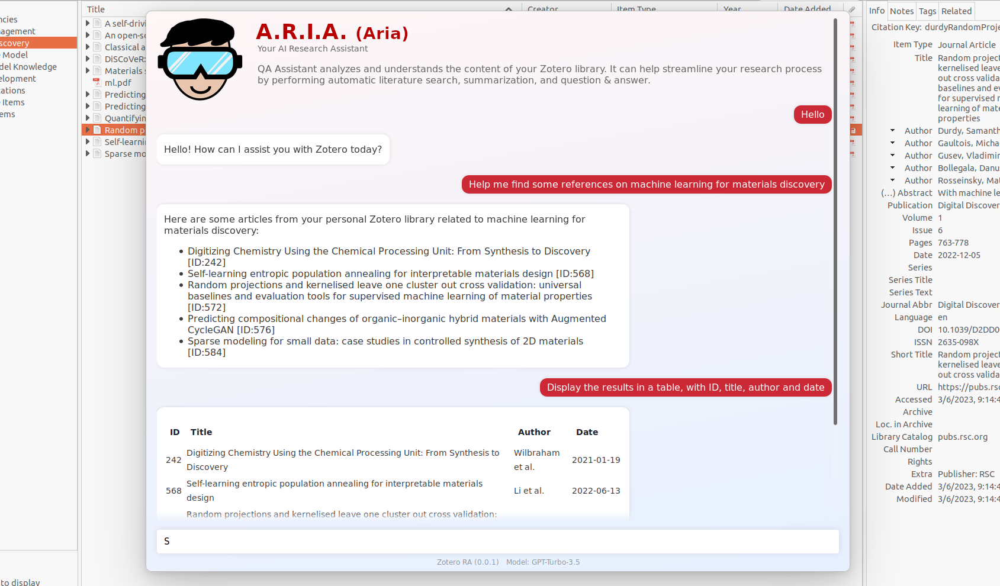
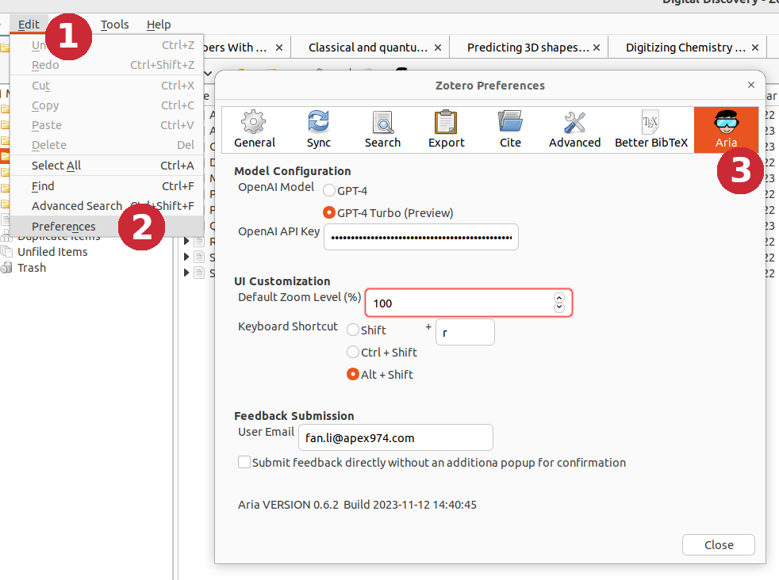

# A.R.I.A. (Aria) - Your AI Research Assistant

Aria is a Zotero plugin powered by Large Language Models (LLMs). A-R-I-A is the acronym of "AI Research Assistant" in reverse order.

## Quickstart

The easist way to get started with Aria is to try one of the interactive prompts in the prompt library.

## Features

### Use Drag-and-Drop to Reference Your Zotero Items and Collections

### Autocompletion for Creators (Authors), Tags, Items and More

### Visual Analysis (GPT-4 Vision)

[_How to use Zotero area annotation to create a draggable area in PDF?_](https://youtu.be/lGeJCsNHBR4?si=sCnnaZCYI2CN8NJ3&t=132)

### Save Chat as Notes and Annotations

## Zotero and GPT Requirements

- Currently, only Zotero 6 is supported. Compatibility with Zotero 7 has not been tested.
- Aria requires the OpenAI GPT-4 model family. ([how can I access GPT-4?](https://help.openai.com/en/articles/7102672-how-can-i-access-gpt-4))
- The visual analysis feature requires the preview access to the GPT-4 Vision model.

## Installation

For a detailed walkthrough of the installation process, please check out: https://twitter.com/MushtaqBilalPhD/status/1735221900584865904 (credit: __Mushtaq Bilal, PhD__ - Syddansk Universitet)

- Download the latest release (.xpi file) from GitHub: https://github.com/lifan0127/ai-research-assistant/releases/latest
- In Zotero select <em>Tools</em> from the top menu bar, and then click on <em>Addons</em>.
- On the Add-ons Manager panel, click the gear icon at the top right corner and select <em>Install Add-on From File</em>
- Select the .xpi file you just downloaded and click <em>Open</em> which will start the installation process.

## Quickstart

By default, Aria can be activated by clicking the  button on Zoterol toolbar or through the "Shift + R" shortcut.

Before using Aria, you need to provide an [OpenAI API Key](https://platform.openai.com/account/api-keys). Follow the in-app instruction to add a key and <b>restart Zotero</b>. ([screenshots](docs/configuration.md))

After restart, you should see the activated Aria window (as shown above) and can start using it through conversations.

## Preferences

Aria is configurable through Edit > Preferences > Aria. Please note that some changes require Zotero restart.

- __Model Selection__: Choose between the base GPT-4 model and the new GPT-4 Turbo model (Preview).
- __Zoom Level__: Adjust the zoom level to fit your screen resolution 
- __Keyboard shortcut__: Change the keyboard shortcut combination to better fit your workflow.

## Update

- Aria can perform automatic update when internet access is available. To check for available update, select <em>Tools</em> from the top menu bar, and then click on <em>Addons</em>.
- To manually update ARIA, click <em>More</em> under Aria and then click the gear icon at the top right corner. Select <em>Check for Updates</em>. ([screenshots](docs/update.md))

## Limitations

The following are known limitations based on user feedback.

- Currently Aria can query your Zotero library through the Zotero search API. The ability to query the Zotero SQLite database for document count and other metrics will be delivered in a future release.
- Aria has limited awareness of your Zotero application state (selected item, current tab, highlighted text). However, you can use the drag-n-drop and the autocompeltion features to provide such context within your message.

## Troubleshooting

  Interaction with Zotero, in an open conversational manner and through a probabilistic model, can lead to many different, often unexpected outcomes. If you experience any error, please create an GitHub issue with a screenshot of the error message from your Aria chat window. Thank you!

- "Agent stopped due to max iterations": For certain questions, the bot will make multiple API calls iteratively for response synthesis. Sometimes, it may fail to produce an answer before reaching the max iterations.

- Aria tab not in Preferences panel: You may choose the __Advanced__ tab in Preferences and open the __Configuration Editor__ Under Advanced Configuration. From there, please search for "aria" and then double-click on the "extensions.zotero.aria.OPENAI_API_KEY" entry to add your OpenAI API Key.

## Development

Refer to the [Zotero Plugin Development](https://www.zotero.org/support/dev/client_coding/plugin_development) guide to find instructions on how to setup the plugin in your local environment.

## Feedback

You can now submit feedback and share your chat session to help improve Aria. Let's make Aria better together!

